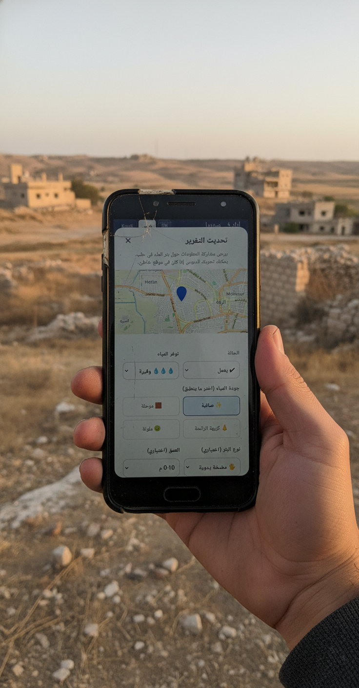

# Syria Well Map – Offline-First Prototype

## Project overview

A lightweight, offline-first web application for mapping and reporting the status of water wells in conflict-affected areas.
Designed for field use with unstable connectivity and low-end mobile devices.

  

## Context

Syria is facing chronic shortages of drinking water, and water infrastructure has been severely damaged by conflict in many places.
Lack of access to repaired electricity is disrupting the lives of millions of residents. The situation is unstable and security is at risk.

## Problems

- Intermittent or no internet access in the field
- High risk of misinterpretation of outdated or incomplete data
- Users may be unfamiliar with technology
- Language barriers: The interface must support both Latin (English/Kurdish) and Arabic (Right-to-Left) scripts seamlessly.
- Cognitive load: In high-stress situations, the UI must be clear, high-contrast, and forgiving.
- Extreme environmental conditions (sun, dust, high contrast surroundings)

## Solution

- Offline-first PWA approach
- Optimized for low-end devices and minimal bandwidth usage
- No libraries except for the map, only system fonts
- Offline data storage using LocalStorage
- Clear visual status markers for wells
- Explicit communication of data freshness and connectivity state
- The application prioritizes clarity, safety, and reliability over visual complexity.

## Key UX & UX-Security decisions

- No user accounts or authentication (reduced attack surface)
- Explicit online / offline indicator
- Last update timestamp visible for each well
- Visual differentiation between:
  - Non-functional wells
  - Contaminated water
  - Wells modified offline (pending sync)
- One-time legend shown on first launch to reduce cognitive load later
- Emoji-based symbols instead of icon fonts for faster recognition and better performance

## Inclusive & Accessible Design

- RTL Adaptation:The interface automatically mirrors itself (margins, icons, text direction) when switching to Arabic.
- Typography: Arabic fonts are dynamically scaled up and line-height is increased to ensure legibility compared to Latin script.
- Color Blindness Safety: The "Contaminated" pin uses a distinct shape (internal dot) + color (Purple) to ensure safety warnings are visible to everyone.
- High contrast for readability.

## Offline behavior

- Maps are available offline only for areas previously opened while online
- Reports created offline are stored locally and synced when connectivity is restored
- Offline changes are clearly marked in the interface

## Security Features

### Client-Side Security

- **Input Sanitization**: All user-generated content (notes, location data) is sanitized to prevent XSS attacks
- **Rate Limiting**: Reports limited to 1 per minute to prevent spam
- **Geographic Validation**: Coordinates validated to ensure reports are within Syria
- **Data Validation**: Storage operations include corruption detection and recovery

### Network Security

- **Content Security Policy (CSP)**: Restricts resource loading to trusted sources only
- **Subresource Integrity (SRI)**: External libraries (Leaflet) verified with cryptographic hashes
- **HTTPS Enforcement**: Automatic upgrade of insecure requests
- **No Authentication by Design**: Zero-knowledge architecture eliminates credential theft risks

### Privacy Protections

- **Local-First Storage**: All data stored on device, no server transmission
- **User-Controlled Deletion**: "Clear All Data" feature for shared devices
- **No Tracking**: Zero analytics, cookies, or third-party scripts
- **Transparent Offline Mode**: Explicit UI indication of connectivity state

### Data Integrity

- **Timestamp Validation**: Last update tracking prevents stale data usage
- **Offline Sync Indicators**: Visual markers for pending synchronization
- **Storage Quota Management**: Graceful handling of localStorage limits
- **Corruption Recovery**: Automatic detection and clearing of invalid data

### Threat Model

This application is designed for use in:

- **Surveillance-hostile environments**: No central server to compromise
- **Low-trust networks**: All data processing happens client-side
- **Shared devices**: Easy data clearing for privacy
- **Unstable infrastructure**: Offline-first prevents data loss

### What We Protect Against

This prototype explicitly mitigates the following threat classes:

- **CDN compromise** — Subresource Integrity (SRI) ensures external libraries cannot be silently altered
- **Man-in-the-middle attacks** — Enforced HTTPS and integrity verification
- **Cross-site scripting (XSS)** — Strict Content Security Policy and input sanitization
- **Supply chain attacks** — Explicit version locking of all third-party dependencies
- **Credential theft and account takeover** - No authentication by design
- **Centralized data breaches** - No backend, local-only storage
- **Misleading UI states leading** to unsafe decisions (explicit offline indicators)
- **Accidental data exposure** on shared devices (local storage + user-controlled deletion)

## Limitations

- Not all map tiles are available offline by default
- Prototype version — data validation and verification workflows are limited
- Not intended for real-time emergency decision-making

## Project status

Prototype
User testing and translation review in progress.

## Tech stack

- **Core**: HTML5, CSS3 (CSS Variables, Flexbox/Grid), Vanilla JavaScript (ES6+)
- **Mapping**: Leaflet.js 1.9.4 (verified with SRI)
- **Storage**: LocalStorage with validation and sanitization (LocalStorage is used in the prototype phase for simplicity; migration to IndexedDB is planned if data volume increases.)
- **PWA**: Service Workers, Web App Manifest
- **Security**: CSP, SRI, input sanitization, client-side throttling

### Dependencies

- **Leaflet.js**: Map rendering and tile management
- **OpenStreetMap**: Map tiles (cached for offline use)
- **Nominatim**: Geocoding search (online only)

All external resources served over HTTPS with integrity verification.

## Disclaimer

This is a prototype created for research, testing, and demonstration purposes.
It should not be used as the sole source of information for critical or emergency decisions.
